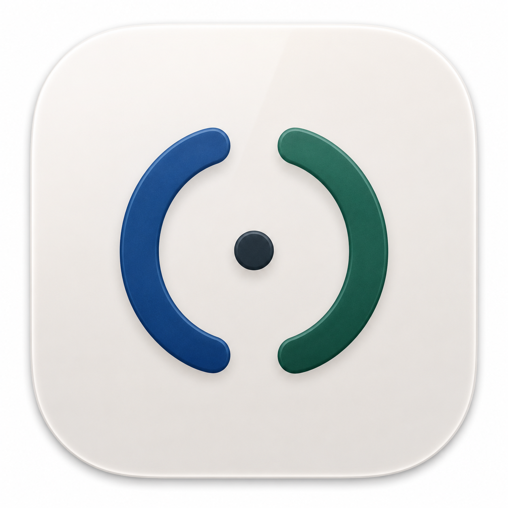
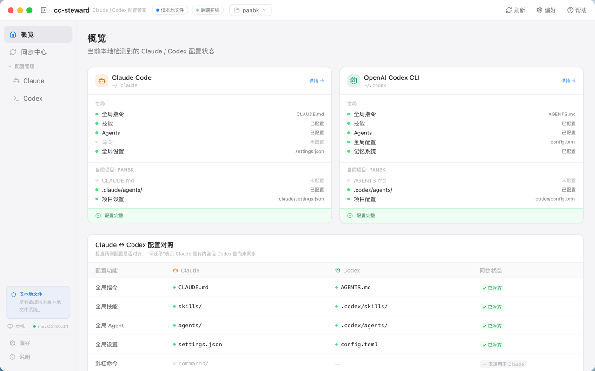
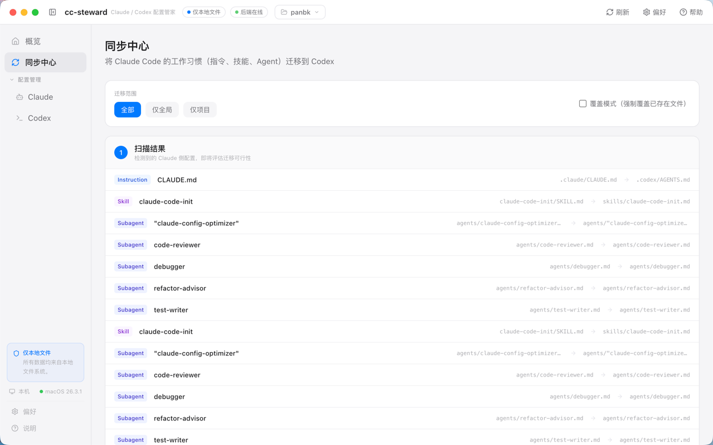

<!-- LOGO -->
<h1>
<p align="center">
  
  <br>cc-steward
</h1>
  <p align="center">
    Claude Code 与 Codex CLI 的本地配置、同步与会话管理桌面工具。<br/>
    可视化管理 <code>CLAUDE.md</code>、<code>AGENTS.md</code>、Skills、Agents、MCP、历史会话与 Token 统计。100% 本地运行。
    <br />
    <br />
    <a href="#快速开始">快速开始</a>
    ·
    <a href="#功能特性">功能特性</a>
    ·
    <a href="#本地构建">本地构建</a>
    ·
    <a href="#数据隐私">数据隐私</a>
  </p>
</p>

<p align="center">
  <a href="https://github.com/Junglepan/Claude-Codex-Steward/releases">
    
  </a>
  
  
  
  
</p>

---

## 预览

Claude Code / Codex CLI 配置总览、同步状态、会话统计和工具调用分析集中在一个本地桌面应用里。





## 快速开始

前往 [Releases](https://github.com/Junglepan/Claude-Codex-Steward/releases) 下载最新版本：

| 平台 | 文件 |
|------|------|
| macOS (Apple Silicon) | `cc-steward-x.x.x-arm64.dmg` |
| Windows x64 | `cc-steward.Setup.x.x.x.exe` |
| Linux x64 | `cc-steward-x.x.x.AppImage` |

启动后，cc-steward 会自动扫描这些本地路径：

| 数据类型 | Claude Code | Codex CLI |
|---|---|---|
| 全局指令 | `~/.claude/CLAUDE.md` | `~/.codex/AGENTS.md` |
| 全局设置 | `~/.claude/settings.json` | `~/.codex/config.toml` |
| 技能 / Agents | `~/.claude/commands/`、`agents/` | `~/.codex/skills/`、`agents/` |
| 项目指令 | `项目/CLAUDE.md` | `项目/AGENTS.md` |
| 项目设置 | `项目/.claude/settings.json` | `项目/.codex/config.toml` |
| 历史会话 | `~/.claude/projects/` | `~/.codex/sessions/` |

> macOS 首次打开提示“已损坏”或“无法验证开发者”时，可执行：
>
> ```bash
> xattr -cr /Applications/cc-steward.app
> ```
>
> 执行后直接双击打开即可。

## 为什么需要 cc-steward

Claude Code 和 Codex CLI 都是常用的 AI 终端编程工具，但它们的配置文件、指令文件、技能目录、Agent 目录和历史会话格式彼此独立。当你同时使用两者时，经常会遇到这些问题：

- **配置分散**：Markdown、JSON、TOML 和目录型配置散落在全局目录与项目目录里。
- **状态不透明**：很难一眼确认哪些配置存在、哪些缺失、当前项目最终生效的是哪一层。
- **同步成本高**：在 Claude Code 侧沉淀的 `CLAUDE.md`、agents、skills 或 hooks，需要手动迁移到 Codex CLI。
- **历史难回顾**：Claude Code 和 Codex CLI 的 JSONL 会话文件位置不同，工具调用、Token 和模型统计不易横向比较。

cc-steward 提供一个本地界面，把配置管理、配置对照、迁移计划、历史会话浏览和统计分析放在一起。

## 功能特性

| 功能 | 说明 |
|---|---|
| 配置总览 | 并排展示 Claude Code 与 Codex CLI 的全局、项目级配置状态 |
| 配置对照 | 对比 `CLAUDE.md` / `AGENTS.md`、settings / config、skills、agents、commands 等配置 |
| 在线编辑 | 在应用内查看、创建、编辑和删除受支持的本地配置文件 |
| 生效配置树 | 展示多层配置合并后的最终值、来源层和覆盖关系 |
| 同步中心 | 扫描可迁移项，生成计划，Dry Run 预览，再确认写入 |
| 会话管理 | 浏览 Claude Code / Codex CLI 历史会话，支持搜索、分页、角色过滤和工具消息折叠 |
| 统计分析 | 汇总会话数、消息数、工具调用、Token、模型分布、项目活跃度 |
| 多项目切换 | 自动发现 Claude / Codex 使用过的项目，也支持手动指定目录 |
| 本地安全 | 写入前备份，限制文件操作范围，不上传配置或会话数据 |

### 配置管理

概览页用双卡片布局展示 Claude Code 和 Codex CLI 的配置状态：

- **全局层**：全局指令、技能、Agents、命令、全局设置，每项标注文件名与配置状态。
- **项目层**：当前项目下的指令文件、agents 目录、项目设置，自动检测文件是否存在。
- **健康状态**：快速判断关键配置是否缺失、是否需要初始化或同步。

配置文件管理页支持按 Agent 深入查看文件树，按全局 / 项目分组展示文件大小、修改时间和存在状态。可直接编辑内容，支持 `⌘S` 保存、`Esc` 取消。

### 配置对照与同步

同步中心用于把一侧已经沉淀好的工作流迁移到另一侧：

- **扫描**：识别指令、技能、Agent、Hook、设置等可迁移项。
- **计划**：标注每项状态：可迁移、需转换、不支持、冲突。
- **Dry Run**：预览执行结果，不实际写入文件。
- **执行**：确认后一键写入，支持增量或替换模式。

常见配置对照：

| 配置功能 | Claude Code | Codex CLI |
|---------|-------------|-----------|
| 全局指令 | `~/.claude/CLAUDE.md` | `~/.codex/AGENTS.md` |
| 项目指令 | `项目/CLAUDE.md` | `项目/AGENTS.md` |
| 全局设置 | `~/.claude/settings.json` | `~/.codex/config.toml` |
| 项目设置 | `项目/.claude/settings.json` | `项目/.codex/config.toml` |
| 技能 | `~/.claude/commands/`、skills 约定目录 | `~/.codex/skills/` |
| Agents | `agents/` | `agents/` |
| Hooks | Claude hooks | Codex hooks |

### 会话管理

会话管理模块用于浏览和回顾 Claude Code / Codex CLI 的历史对话：

- 自动发现 `~/.claude/projects/` 和 `~/.codex/sessions/` 下的会话文件。
- 按项目分组展示会话列表，显示数量、最后活跃时间和来源 Agent。
- 全局搜索会话内容，支持角色和工具名过滤。
- 对话视图使用聊天气泡展示用户消息、AI 回复、工具调用和工具结果。
- 支持分页加载、长工具输出折叠、角色过滤、工具消息开关。
- 可复制项目路径、文件路径、Session ID 和 `claude --resume <uuid>` 命令。

Codex 会话解析器支持 `session_meta`、`event_msg`、`response_item` 等 JSONL 记录，提取项目路径、会话标题、消息、工具调用、Token 和模型信息。

### 快捷键

| 快捷键 | 功能 |
|--------|------|
| `⌘K` | 打开命令面板，跨页面、文件、命令搜索与跳转 |
| `⌘R` | 刷新所有数据 |
| `⌘B` | 切换侧栏折叠 |
| `⌘1` ~ `⌘5` | 切换模块 |
| `/` | 聚焦搜索框 |
| `?` | 打开快捷键速查表 |

### 外观

支持浅色、深色、跟随系统三档主题，通过 CSS 变量驱动全局 token。在“偏好 → 外观”中切换。

## 数据隐私

cc-steward 是本地桌面应用。它读取本机 `~/.claude/`、`~/.codex/` 和当前项目目录中的配置与会话文件，用于展示、搜索、统计和同步。

- 不上传配置文件。
- 不上传历史会话。
- 不上传 Token 统计。
- 不包含远程分析、埋点或遥测。
- 文件写入和删除限制在允许的本地路径内。
- 写入或删除前自动生成 `.bak.<YYYYMMDD-HHMMSS>` 备份。

## 本地构建

**前置依赖**

- [Node.js](https://nodejs.org/) 20+
- [Python](https://www.python.org/) 3.10+
- npm

```bash
# 安装依赖
npm install

# 开发模式，启动 Vite + Electron
npm run dev

# Electron 开发模式，需先启动前端或使用 npm run dev
npm run build:electron
npm run dev:electron

# 生产构建，前端 + Electron 打包
npm run build
```

国内环境安装 Electron 二进制较慢时，可使用镜像：

```bash
ELECTRON_MIRROR=https://registry.npmmirror.com/-/binary/electron/ node node_modules/electron/install.js
```

### 环境变量

| 名称 | 用途 |
|---|---|
| `CC_STEWARD_PROJECT` | 显式指定项目目录，兼容旧 `CCT_PROJECT` |
| `CC_STEWARD_DEVTOOLS=1` | Electron 启动时打开 DevTools |

### 端口

| 端口 | 服务 |
|---|---|
| 5174 | Vite 开发服务器 |

## Troubleshooting

| 问题 | 处理方式 |
|---|---|
| 找不到 Claude Code 数据 | 确认 `~/.claude/` 和 `~/.claude/projects/` 存在，并且 Claude Code 已产生过会话 |
| 找不到 Codex CLI 数据 | 确认 `~/.codex/` 和 `~/.codex/sessions/` 存在，并且 Codex CLI 已产生过会话 |
| macOS 提示无法验证开发者 | 执行 `xattr -cr /Applications/cc-steward.app` 后重新打开 |
| 开发模式端口冲突 | 释放 5174 端口，或按 Vite 提示使用新端口 |
| 会话统计为 0 | 确认选择的是正确项目范围，或切换到全局会话视图 |
| 同步前不确定会写入什么 | 先运行 Dry Run，只预览变更，不写入文件 |

## 技术栈

| 层 | 技术 |
|---|---|
| 前端 | React 18 + TypeScript + Vite |
| UI | Tailwind CSS + Zustand + Lucide Icons |
| 后端 | Electron IPC + Node.js 文件系统能力 |
| 桌面 | Electron |
| CI/CD | GitHub Actions，类型检查与三端自动打包发布 |

## 项目结构

```text
├── src/                    # 前端源码
│   ├── core/               #   API 客户端、模块/Agent 注册
│   ├── components/         #   共享 UI 组件
│   ├── hooks/              #   共享 Hooks
│   ├── modules/            #   页面模块
│   │   ├── overview/       #     首页概览
│   │   ├── agent-config/   #     Agent 配置详情
│   │   ├── sync/           #     同步中心
│   │   ├── sessions/       #     会话管理
│   │   ├── settings/       #     偏好设置
│   │   └── help/           #     帮助文档
│   ├── store/              #   Zustand 全局状态
│   └── lib/                #   工具函数
├── electron/               # Electron 主进程 + preload + IPC 后端
│   └── backend/            #   本地文件扫描、同步、备份、配置解析
│       └── sessions/       #   会话解析、搜索、统计、回收
├── assets/                 # 应用图标
├── public/                 # 静态资源
└── .github/workflows/      # CI + Release 工作流
```

## 文档

- [DESIGN.md](DESIGN.md) — 产品设计文档
- [docs/IMPLEMENTATION.md](docs/IMPLEMENTATION.md) — 实现方案
- [CHANGELOG.md](CHANGELOG.md) — 版本迭代记录

## 作者

[@panbokui](https://github.com/panbokui)

## License

[MIT](LICENSE)
